<p align="center">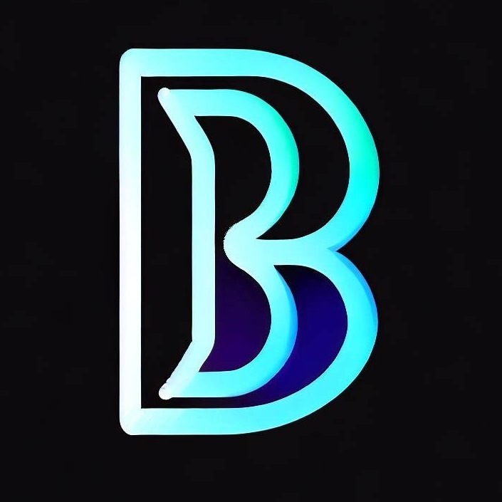

</p>

# Laravel Boilerplate

Touch Star Follow package: https://github.com/byteplatform/byteplatform

## Feature(New):

-   Modules
-   Themes
-   Plugins
-   Actions
-   ShortCodes
-   CURD Base
-   Auth(User,Role,Permission)
-   Setting

## Technology used:

-   Laravel 10x
-   Livewire 3x
-   unisharp/laravel-filemanager 2.6
-   staudenmeir/eloquent-eager-limit 1.8.3
-   Boostrap 5x
-   Tabler and Tabler-icon

## Requirements

PHP 8.2+

## Installation

You can install package via composer

```bash
$ composer install
$ php artisan migrate
$ php artisan b:setup
$ php artisan vendor:publish --tag=lfm_config
$ php artisan vendor:publish --tag=lfm_public

```

***Note***: If the interface is experiencing an error, please delete the 'bykit' folder within the 'public' folder and refresh the website page. The error should be resolved automatically.

```bash
account: admin@hau.xyz
password: AdMin@123

```

## Usage

Make module:

```bash
$ php artisan mb:module Demo3 -a true -f true
```

Make plugin:

```bash
$ php artisan mb:plugin Demo3 -a true -f true
```

Make theme:

```bash
$ php artisan mb:theme Demo3 -a true -t theme -f true
```

## Screens

<p align="center">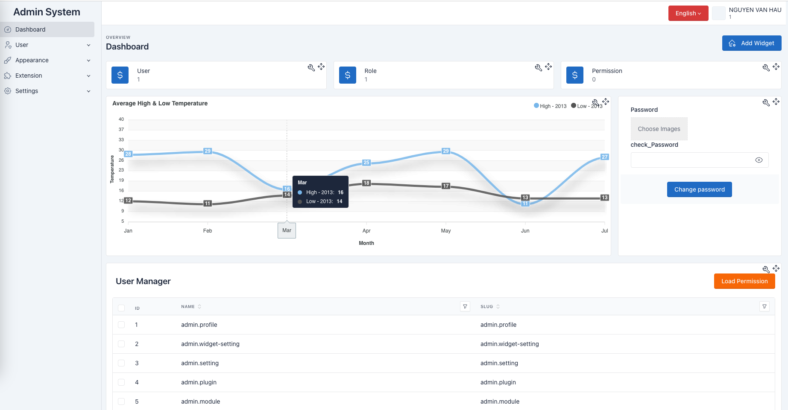</p>
<p align="center">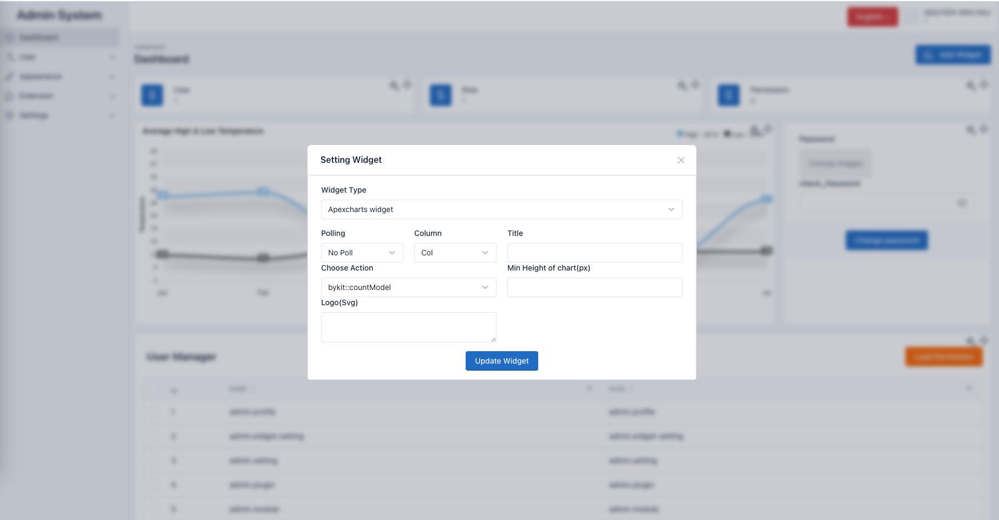</p>
<p align="center">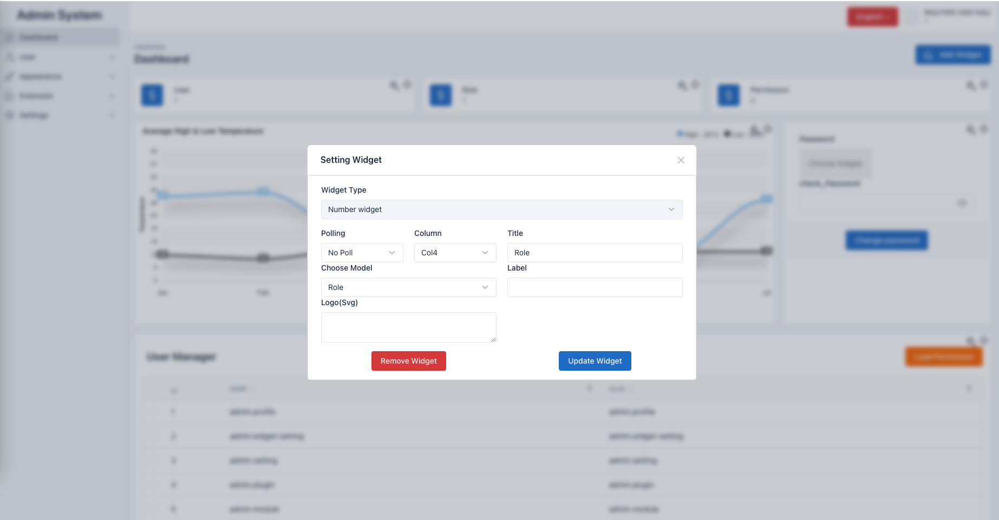</p>
<p align="center">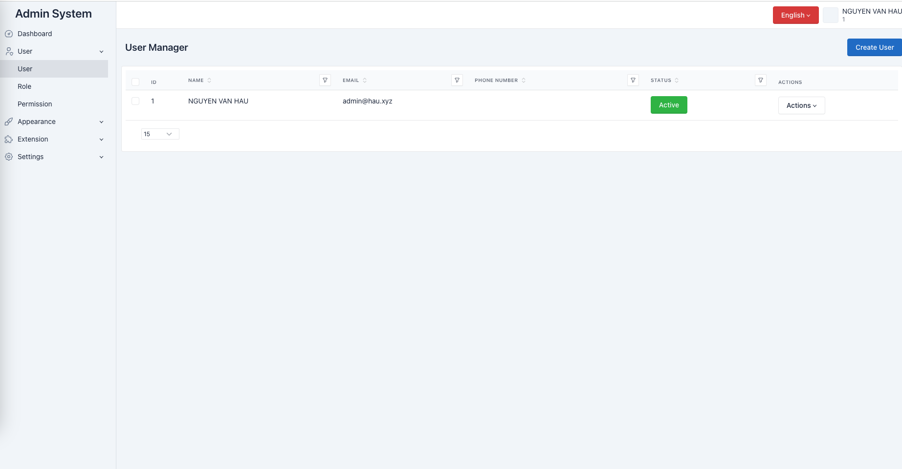</p>
<p align="center">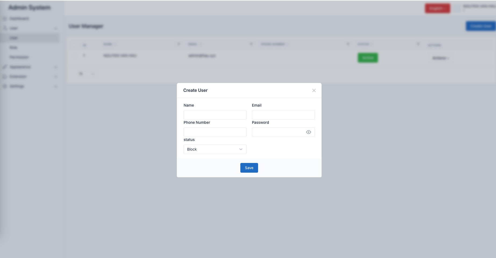</p>
<p align="center">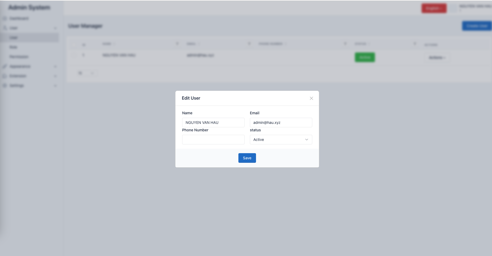</p>
<p align="center">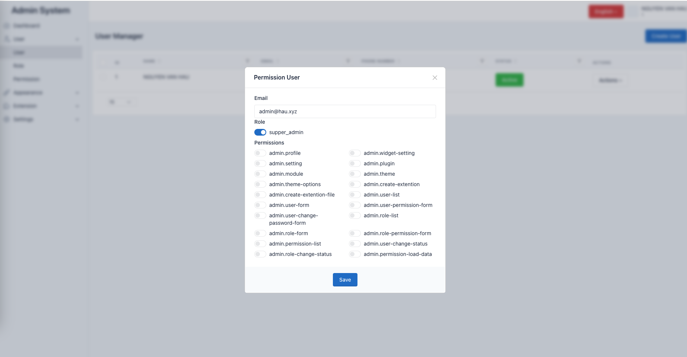</p>
<p align="center">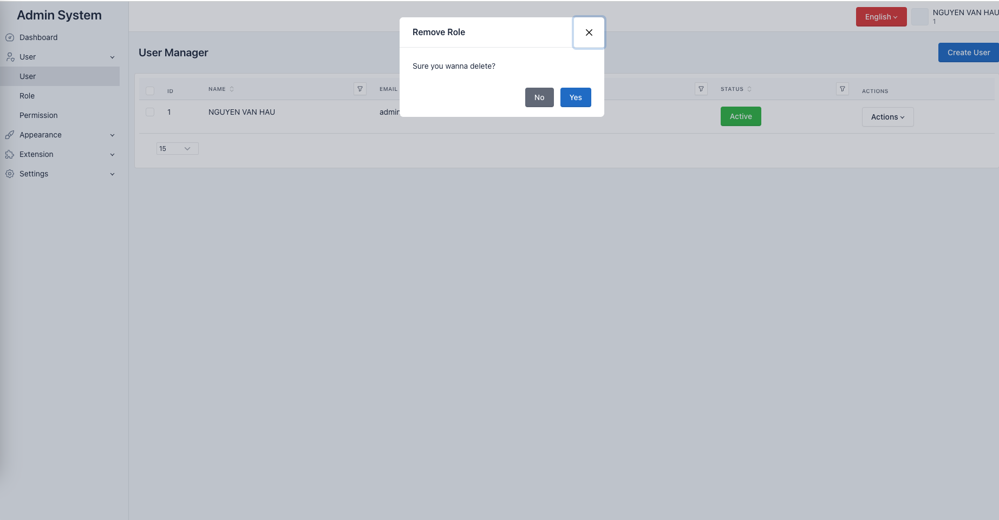</p>
<p align="center">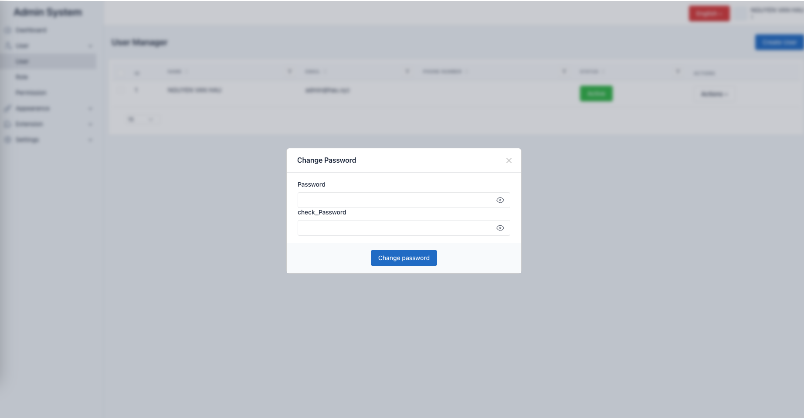</p>
<p align="center">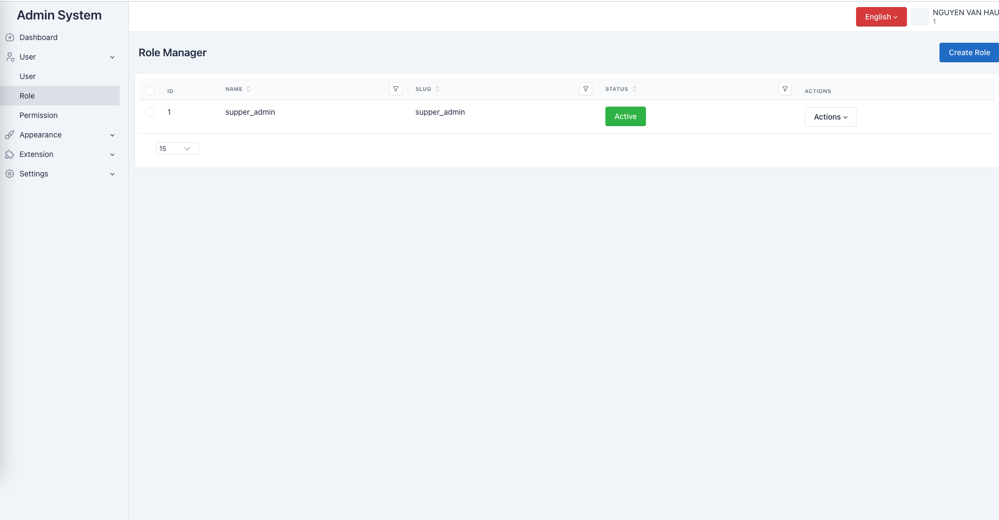</p>
<p align="center">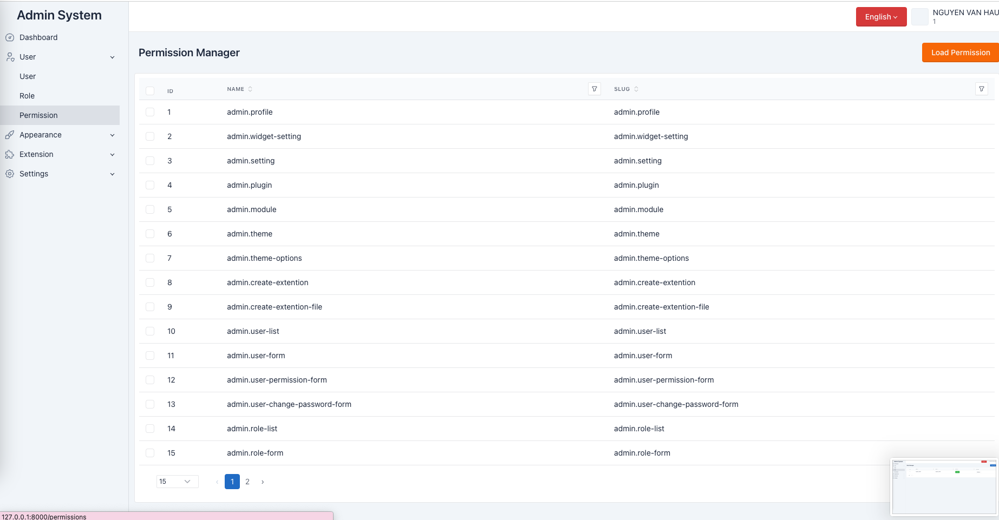</p>
<p align="center">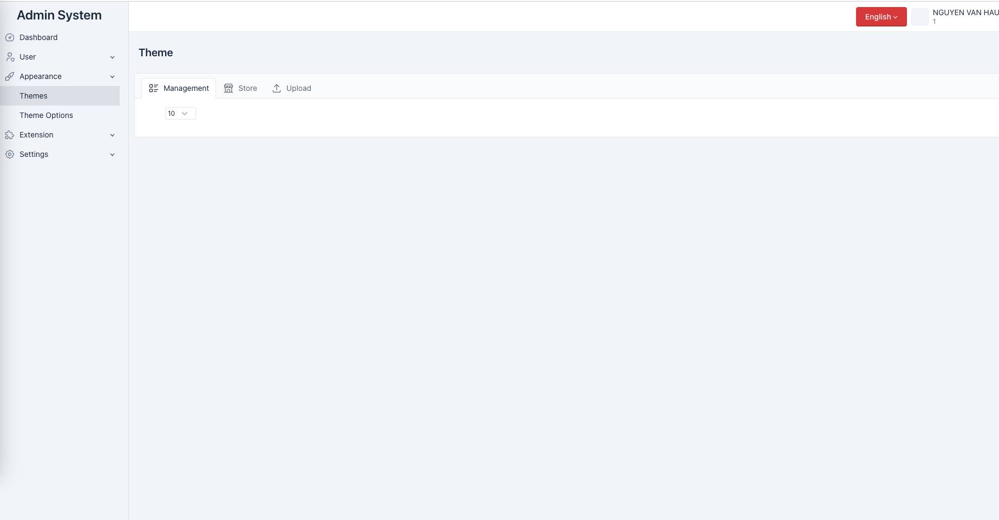</p>
<p align="center">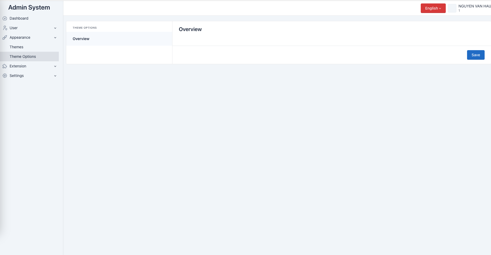</p>
<p align="center">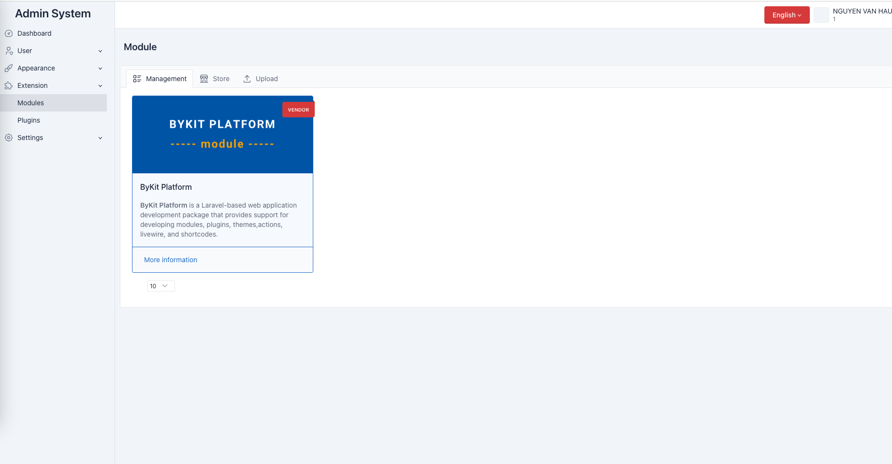</p>
<p align="center">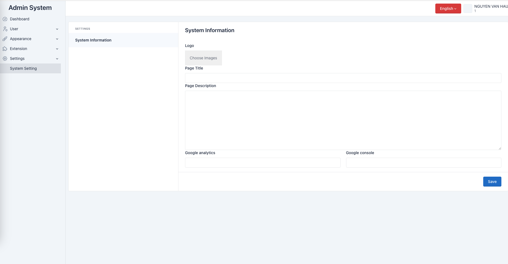</p>
<p align="center">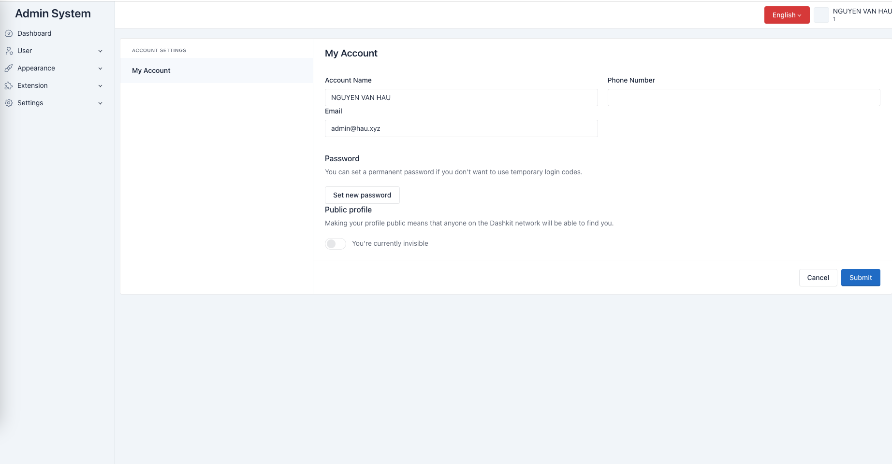</p>
## Contributing

Pull requests are welcome. For major changes, please open an issue first to discuss what you would like to change.

https://github.com/byteplatform/byteplatform/discussions

Please make sure to update tests as appropriate.

## Product list:

[Free Online Tutorials](https://tutorialaz.com/)

site: https://bytechasia.com/

email contact: nguyenvanhaudev@gmail.com

## License

[MIT](./LICENSE)
